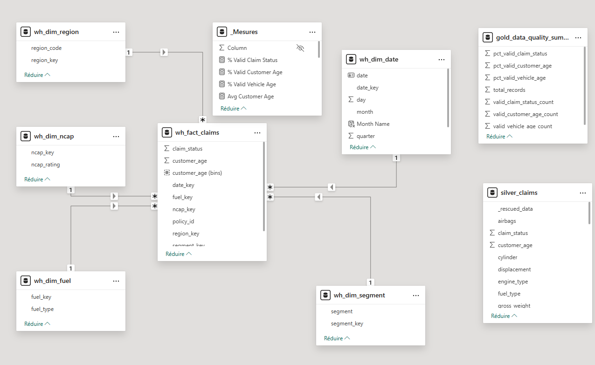
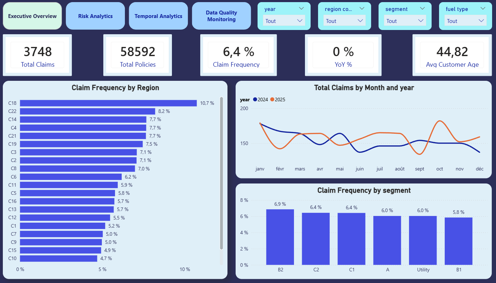
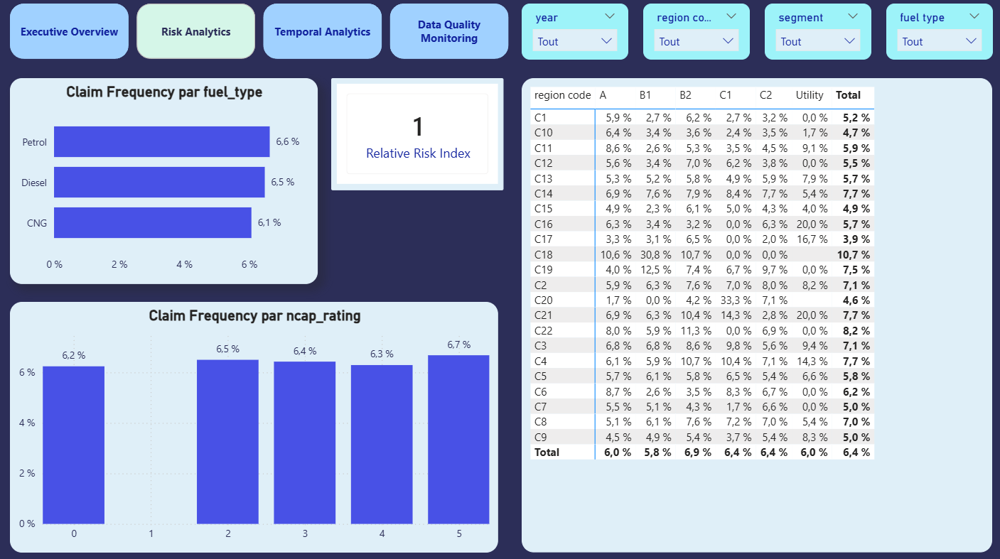
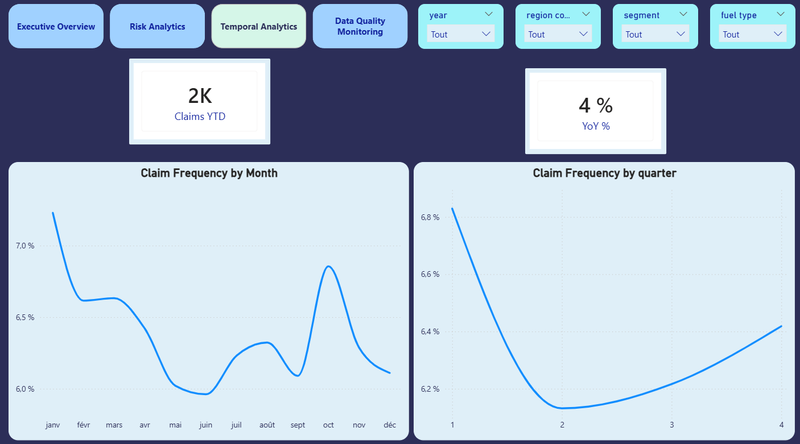
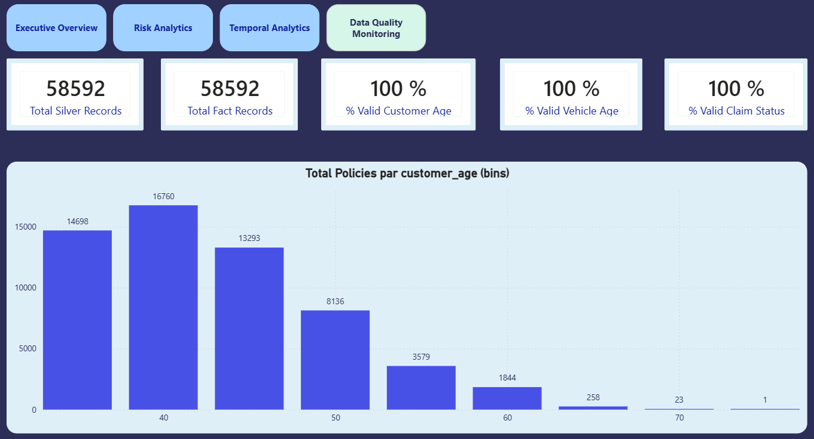

# 🚗 Plateforme Data Insurance – Architecture Medallion & Dashboard BI

## 📌 Présentation du projet

Ce projet met en œuvre une architecture Medallion (Bronze → Silver → Gold) sur Databricks Lakeflow (Declarative Pipelines), combinée à un Data Warehouse en modèle étoile et un dashboard Power BI stratégique.

L’objectif est de simuler une plateforme d’analyse assurance automobile production-ready, intégrant :

- Bonnes pratiques Data Engineering
- Modélisation dimensionnelle (Star Schema)
- Delta Lake
- Data Quality Monitoring
- Mesures DAX avancées
- Analyse risque métier

## 🏗️ Architecture

### 🔷 Architecture Medallion

Raw Data (CSV)
     ↓
Bronze (Streaming - Autoloader)
     ↓
Silver (Nettoyage + Qualité + Feature Engineering)
     ↓
Gold
   ├── Data Warehouse (Modèle étoile)
   └── Data Marts analytiques

## 🎥 Démonstration de l’exécution du pipeline

La vidéo suivante montre l’orchestration complète du pipeline Lakeflow 

(Bronze → Silver → Warehouse → Marts) ainsi que la matérialisation des tables Delta.

Elle illustre :
- Les dépendances entre tables
- L’ordre d’exécution
- La matérialisation des couches
- Le monitoring des runs

👉

### 🥉 Bronze Layer

- Ingestion streaming via Databricks Autoloader

- Données brutes stockées en Delta

- Évolution de schéma activée

### 🥈 Silver Layer

**Transformations réalisées** :

- Cast des types (âge, statut sinistre, NCAP)

- Normalisation booléenne

- Parsing des colonnes moteur (torque / power via regex)

- Ajout d’une date technique d’ingestion

- Suppression des doublons

- Data Quality Expectations intégrées

**Règles de qualité** :

- Âge client ≥ 18

- Âge véhicule ≥ 0

- Claim status ∈ {0,1}

### 🥇 Gold Layer

🔹 **Data Warehouse (Modèle en étoile)**

Table de faits :

- wh_fact_claims

Tables de dimensions :

- wh_dim_region
- wh_dim_segment
- wh_dim_fuel
- wh_dim_ncap
- wh_dim_date

Ce modèle permet :

- Agrégations dynamiques côté BI
- Analyse multi-axes
- Performance optimisée

🔹 **Data Marts**

Tables agrégées :

- mart_claim_by_fuel
- mart_claim_by_segment
- mart_claim_metrics
- mart_risk_by_ncap
- mart_data_quality_summary

--- 

## 🗂️ Modèle en étoile

---

## 📊 Dashboard Power BI

### 🟦 1. Executive Overview

### 🟦 2. Risk Analytics

**Analyse approfondie du risque** :

### 🟦 3. Temporal Analytics

**Analyse temporelle avancée** :

🟦 4. Data Quality Monitoring

## 📐 Mesures DAX avancées

Exemples :

Claim Frequency =
DIVIDE(
    SUM(wh_fact_claims[claim_status]),
    COUNT(wh_fact_claims[policy_id])
)

Relative Risk Index =
DIVIDE(
    [Claim Frequency],
    CALCULATE([Claim Frequency], ALL(wh_dim_segment))
)

---

## ⚙️ Optimisations & Industrialisation

**Format Delta Lake** :
Les données sont stockées au format Delta afin de garantir la fiabilité transactionnelle (ACID), l’optimisation des performances et la gestion simplifiée des évolutions de schéma.

**Lakeflow Declarative Pipeline** :
Les transformations sont orchestrées via Lakeflow, permettant une gestion déclarative, reproductible et industrialisable du pipeline de données.

**Expectations qualité intégrées** :
Des règles de validation (âge client, âge véhicule, statut sinistre) sont appliquées dès la couche Silver afin d’assurer la fiabilité analytique en aval.

**Star Schema BI-ready** :
La couche Gold est structurée en modèle étoile (fact + dimensions) pour garantir des performances optimales et une exploitation flexible dans Power BI.

**Pipeline planifié (schedule)** :
Le pipeline est exécuté automatiquement via un planificateur, simulant un environnement de production avec rafraîchissement régulier des données.

**Optimisation automatique Delta** :
Les mécanismes d’auto-optimisation (optimize write, auto compaction) sont activés afin d’améliorer les performances de lecture et réduire la fragmentation.

**Simulation temporelle réaliste** :
Une distribution temporelle des données sur plusieurs années a été simulée pour permettre des analyses YTD, YoY et tendances mensuelles crédibles.

---

🧠 Compétences démontrées

**Data Engineering (Databricks)** :
Conception et orchestration d’un pipeline complet de traitement de données sur une plateforme cloud moderne.

**Architecture Medallion** :
Implémentation structurée Bronze → Silver → Gold garantissant séparation des responsabilités et qualité progressive des données.

**Modélisation dimensionnelle** :
Création d’un modèle en étoile optimisé pour l’analyse décisionnelle et la performance BI.

**Delta Lake** :
Utilisation d’un format transactionnel robuste permettant la fiabilité, l’optimisation et l’évolutivité des tables analytiques.

Data Quality Monitoring :
Mise en place d’indicateurs de qualité et de suivi volumétrique pour sécuriser la chaîne analytique.

**DAX avancé** :
Création de mesures dynamiques (Time Intelligence, Index de risque, segmentation) pour produire des indicateurs stratégiques.

**Storytelling BI** :
Structuration du dashboard en pages orientées décision (Executive, Risk, Temporal, Monitoring).

**Optimisation analytique** :
Conception orientée performance en séparant Data Warehouse et Data Marts.

---

🛠️ Stack technique

Databricks Lakeflow :
Orchestration déclarative du pipeline et gestion automatisée des dépendances.

Delta Lake :
Stockage transactionnel optimisé pour analytics.

Unity Catalog :
Gestion centralisée de la gouvernance et des objets analytiques.

PySpark :
Transformation distribuée et feature engineering.

SQL :
Requêtes analytiques et validation des données.

Power BI :
Visualisation stratégique et création d’indicateurs décisionnels.

DAX :
Modélisation analytique avancée et calculs dynamiques.

## 🚀 Améliorations futures

**SCD Type 2** :
Implémentation de dimensions historisées afin de gérer l’évolution des attributs métier dans le temps.

**Historisation des runs** :
Ajout d’une table de suivi des exécutions pour monitorer les performances et volumes traités.

**Monitoring avancé** :
Mise en place d’alertes et d’indicateurs techniques pour simuler un environnement production.

**CI/CD** :
Intégration Git et automatisation des déploiements.

**Liquid Clustering** :
Optimisation avancée des performances pour les tables volumineuses.

**Tests automatisés** :
Ajout de tests unitaires et contrôles de cohérence sur les transformations.

## 📂 Structure du repository

/src
   bronze_claims.py
   silver_claims.py
   wh_fact_claims.py
   wh_dim_*.py
   mart_*.py

/screenshots
   executive_overview.png
   risk_analytics.png
   temporal_analytics.png
   data_quality.png
   star_schema_model.png

README.md

